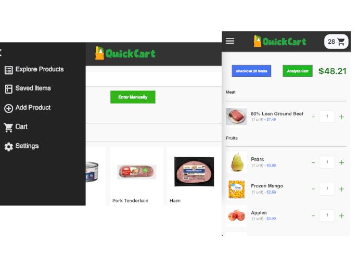

<h1 align="center">QuickCart <a href="https://grocery-client-sl.herokuapp.com/">  DEMO</a></h1>

<p align="center">
  
  
  
</p>

<!--  -->

<p align="center">Make a shopping list with personal grocery data to help budget.</p>

<p align="center">
  <a href="#setup">Setup</a>  •
  <a href="#technologies">Technologies</a> •
  <a href="#features">Features</a> •
  <a href="#contributing">Contributing</a>
</p>

<p align="center">
  <a href="https://grocery-client-sl.herokuapp.com/">
    
  </a>
</p>

## ⚙️ Setup:
- Configue the ```.env``` file (**[Configure API Keys](<#configure api keys>)**)
```sh
    npm install
    npm run husky:prepare
    npm run dev
```

## 📦 Technologies:
- [React](https://reactjs.org/)
- [Firebase](https://firebase.google.com/)
- [OpenFoodFacts](https://world.openfoodfacts.org)
- [Google CSE](https://cse.google.com)
- [Material-UI](https://material-ui.com/)
- [Spoonacular](https://spoonacular.com/food-api/docs)

## 🌟 Features:
- Save grocery products to a cart
- Browse new products
- Analyze the cart to fill empty categories
- Save new custom products
- Create an account to access lists anywhere
- Add custom images and values to each item
- View recommended items to buy
- Log cart purchases

## 🔑 Configue API Keys
1.  **Create a Firebase project**:

  - Navigate through to the SDK slide
  - Save Firebase API keys
  - Update the **Authentication** tab:
    - Activate email/password authentication
    - List <__your_domain_url__> or __localhost__ under:
      > Authentication > Sign-in method > Authorized domains
  - Under **Firestore**:
    - Configure a Firestore database
    - Update Firestore **rules**

2.  **Get the Spoonacular API key**:

  - Create an account [here](https://spoonacular.com/food-api)
  - Navigate to > Console > Profile

## ❇️ Contributing

See [TODO](./TODO) - Feel free to create a pull request or suggest a feature :D

---

> [spencerlepine.com](https://www.spencerlepine.com) &nbsp;&middot;&nbsp; GitHub [@spencerlepine](https://github.com/spencerlepine) &nbsp;&middot;&nbsp; Twitter [@spencerlepine](http://twitter.com/spencerlepine)
