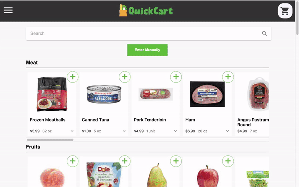
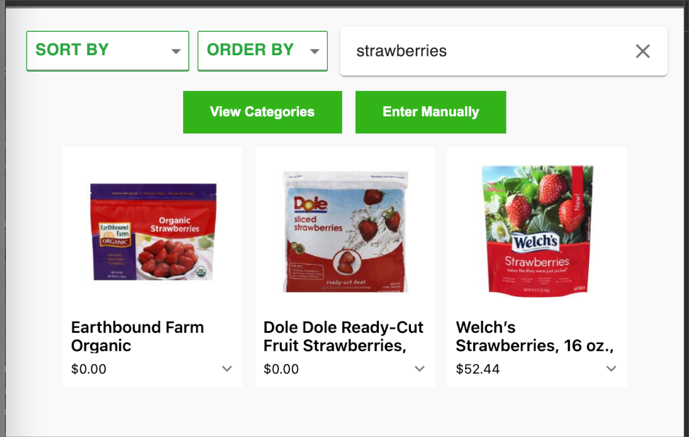
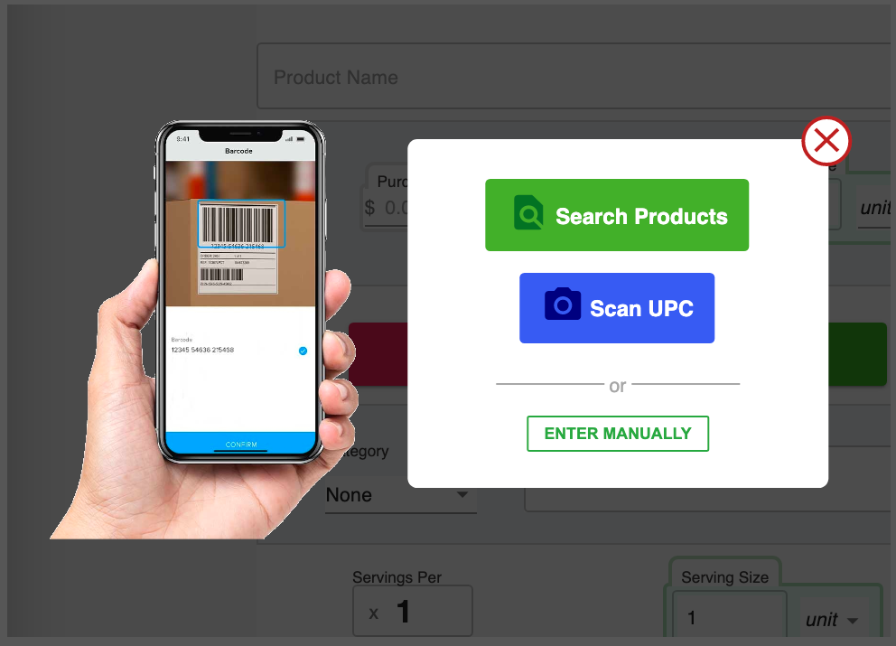
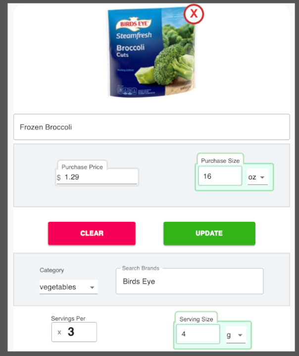
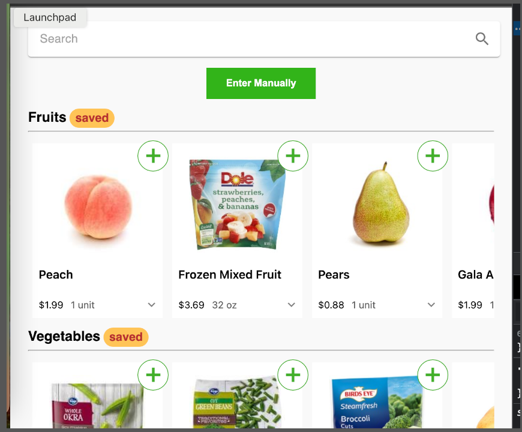

# [QuickCart](https://grocery-client-sl.herokuapp.com/) &middot; [](https://github.com/spencerlepine/quickcart/actions/workflows/main.yml) [](https://coveralls.io/github/spencerlepine/quickcart?branch=master)

Make a shopping list with personal grocery data to help budget.



## Overview:
A grocery product catalog to assist budgeting and managing a shopping list stored in the cloud.

- Designed a Firebase Cloud Firestore NoSQL database managing user records, grocery product catalogs, and cart purchase histories
- Organized state management for products, account information, and carts with Context hooks also persisted in the database.
- Integrated Firebase Authentication to assist storing user unique shopping lists, along with customized product records.
- Created a clean and modern user experience  with Material UI following a wireframe and site-wide color theme.
- Implemented barcode scanning and external records from the OpenFoodFacts API to onboard new products

## ⚙️ Setup:
```sh
    $ cp .env.sample .env
    $ npm install
    $ npm run dev
```

## 📦 Technologies:
- [React](https://reactjs.org/)
- [Firebase](https://firebase.google.com/)
- [React Testing Libary](https://testing-library.com/)
- [Material-UI](https://material-ui.com/)
- [OpenFoodFacts](https://world.openfoodfacts.org)
- [Google CSE](https://cse.google.com)
- [Spoonacular](https://spoonacular.com/food-api/docs)

## 🌟 Features:
- Browse grocery products
- Save items to cart
- Analyze the cart to fill empty categories
- Save new customized products
- Create an account to access lists anywhere
- Scan a bar code to upload a product
- See a history of cart receipts









---

🏠 [spencerlepine.com](https://www.spencerlepine.com) &nbsp;&middot;&nbsp; 😺 GitHub [@spencerlepine](https://github.com/spencerlepine) &nbsp;&middot;&nbsp; 🐦 Twitter [@spencerlepine](http://twitter.com/spencerlepine)
