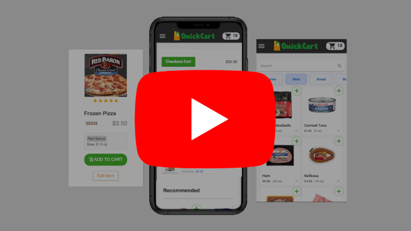
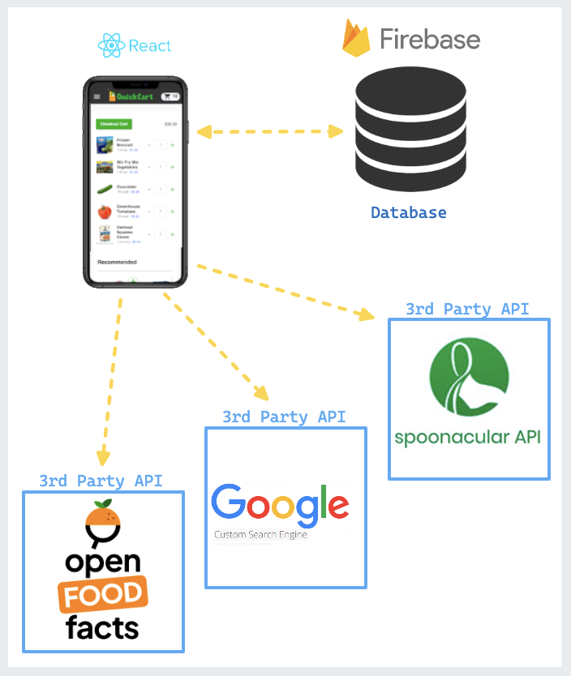

# [QuickCart](https://grocery-client-sl.herokuapp.com/) &middot; [](https://github.com/spencerlepine/quickcart/actions/workflows/main.yml) [](https://coveralls.io/github/spencerlepine/quickcart?branch=master)

Create and store weekly grocery shopping lists. Find real products via search or barcode scan, view nutrition facts, or upload your own.


[](https://www.youtube.com/watch?v=2YrizGT_2xA)

## 🎯 Project Overview
A grocery product catalog to assist budgeting and managing a shopping list stored in the cloud.

- Designed a **Firebase Cloud Firestore NoSQL** database managing user records, grocery product catalogs, and cart purchase histories
- Organized state management for products, account information, and carts with Context hooks also persisted in the database.
- Integrated Firebase **Authentication** to assist storing user unique shopping lists, along with customized product records.
- Created a clean and modern user experience with **React/MaterialUI** following a wireframe and site-wide color theme.
- Implemented barcode scanning and external records from the **Spoonacular** + **OpenFoodFacts** API to onboard new products

## 📦 Technologies:
- [React](https://reactjs.org/)
- [Firebase](https://firebase.google.com/)
- [React Testing Libary](https://testing-library.com/)
- [Material-UI](https://material-ui.com/)
- [OpenFoodFacts](https://world.openfoodfacts.org)
- [Google CSE](https://cse.google.com)
- [Spoonacular](https://spoonacular.com/food-api/docs)

## 🏗️ Architecture



## 🌟 Features:
- Browse grocery products records served from the Firestore database
- Save products to your cart, always persisted in the cloud.
- Analyze the cart to identify empty categories
- Customized product records and create a personal list
- Create an account to access your list anywhere
- Scan a bar code to upload a product pulled from Spoonacular or OpenFoodFacts
- View a history of transaction receipts previous from shopping lists
- Save product images with a convient image searching pop-up connected to Google CSE


## ⚙️ Local Development

```sh
    $ cp .env.sample .env
    $ npm install
    $ npm run dev
```

## 🌐 Links
- Demo website: (DEPRECATED) https://grocery-client-sl.herokuapp.com/
- Demo video: [Youtube](https://www.youtube.com/watch?v=2YrizGT_2xA)
- Blog post: https://www.spencerlepine.com/portfolio/quickcart
